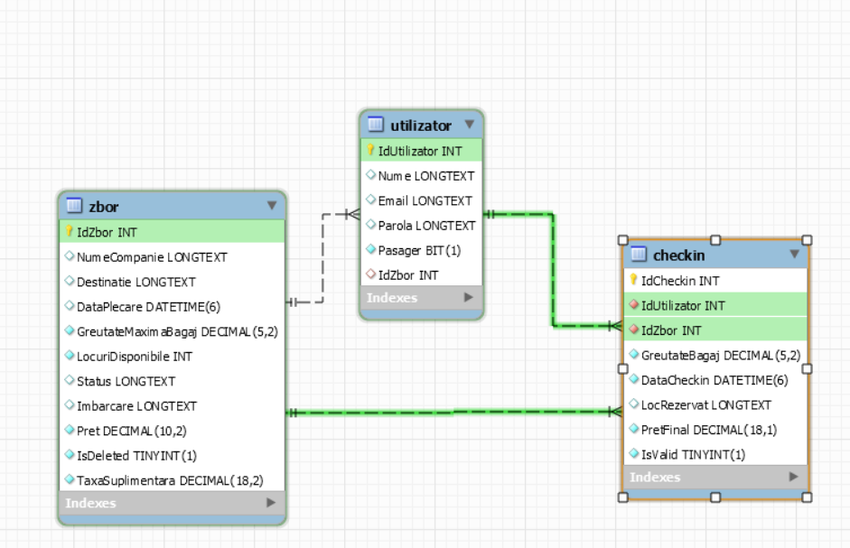
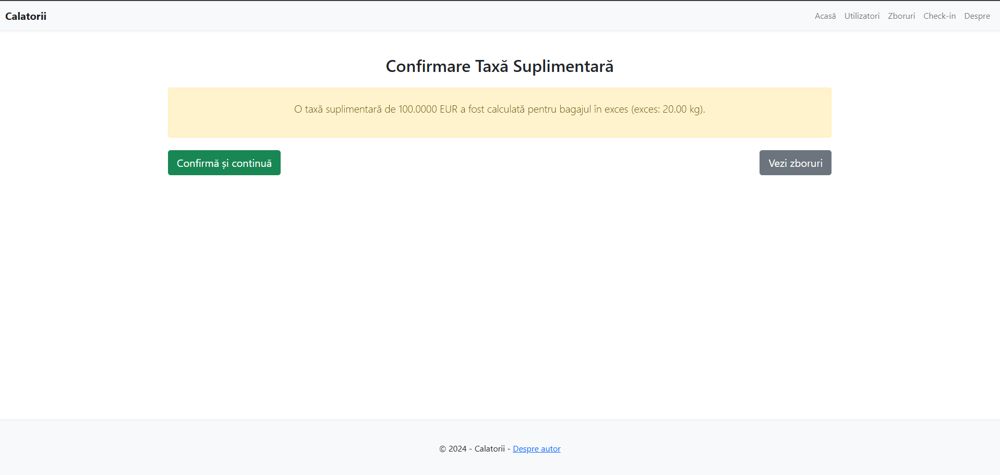
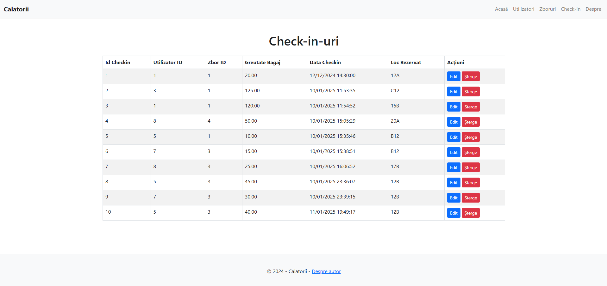
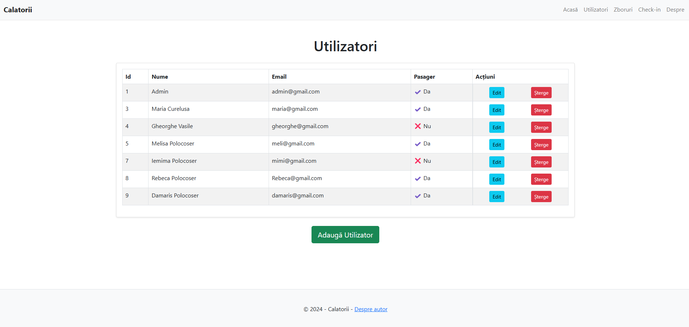
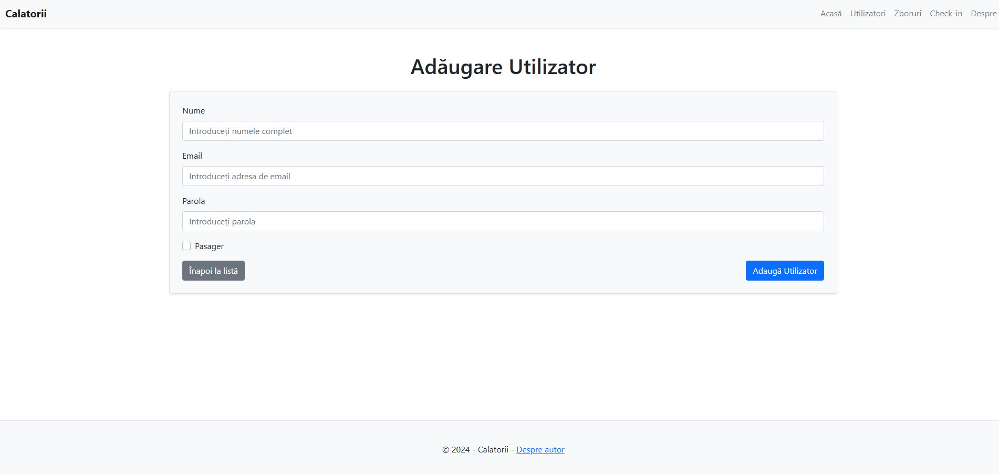
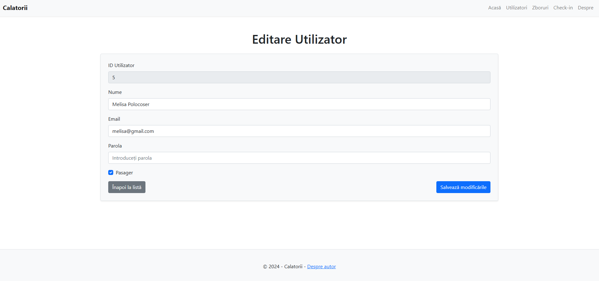
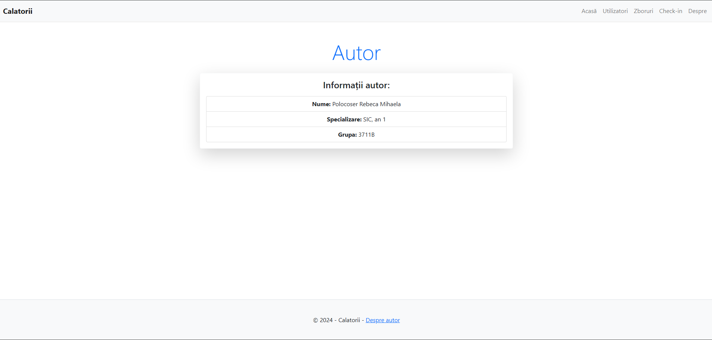

# Calatorii - Flight Management System

## Description

"Calatorii" is a flight management application that allows users to view, modify, and book flights. The application provides comprehensive functionality for managing flights, including data validation, calculating additional baggage fees, and managing available seats.

## Features

- **View Flights**: Allows users to view details about available flights, including the airline name, boarding location, destination, departure date, price, and flight status.
- **Flight Details**: Provides detailed information about each flight, including ID, boarding location, destination, and maximum baggage weight.
- **Check-in**: Allows users to check-in for planned flights and view the necessary details.
- **Flight Management**: Allows adding, editing, and deleting flights.
- **Additional Fees**: Automatically calculates additional baggage fees based on baggage weight.

## Technologies Used

- **.NET Core 5**: The main framework used for the application's development.
- **ASP.NET MVC**: The application's architecture based on Model-View-Controller (MVC).
- **Entity Framework Core**: ORM for managing data.
- **SQL Server**: The database for storing flight and user information.
- **Bootstrap**: CSS framework for responsive and attractive design.
- **HTML, CSS, JavaScript**: For creating the user interface and implementing front-end functionalities.

### Explanation:

- **Title**: The file starts with a clear title describing your project.
- **Description**: Provides a concise overview of what the application does.
- **Features**: A list of key features of the application.
- **Technologies Used**: Lists the main technologies and frameworks used to build the app.
- **Installation**: Detailed installation steps for both developers (to run locally) and end users (for accessing the app).
- **Usage**: Describes how users can interact with the application.
- **Project Structure**: Describes the folder structure and where key components are located.
- **Contributing**: Encourages others to contribute by outlining how to contribute to the project.

### Documentation

 - You can open Documentation file for some pictures and some more detalis about this project

### ------------------- Screenshots -------------------

Here are some screenshots of the application in action:

### Database
  
Here you can see the structure of the database created in MySQL Workbench.

### Homepage
  
The homepage of the application shows the application name. From here, users can start booking a flight.

### Flight List
  
This page displays a list of available flights and provides links to manage flight bookings.

### Flight Details
  
This page shows detailed information for a selected flight, such as the destination, departure time, and available seats.

### Check-in Page
  
Here, users can check in for their flight. They can also add the weight of their luggage. If the luggage exceeds the weight limit, an additional fee will be added.

### Baggage Fee
  
Here you can see how the fee is calculated based on the weight of the luggage.

### Check-ins Overview
  
This page displays all the check-ins stored in the database.

### Users
  
Here you can see a list of all users in the database.

### Add User
  
Here you can see the interface for adding a new user to the database.

### Edit User
  
Here you can see how you can edit a user’s information in the database.

### Author Details
  
Here you can find some details about the author of this project.

